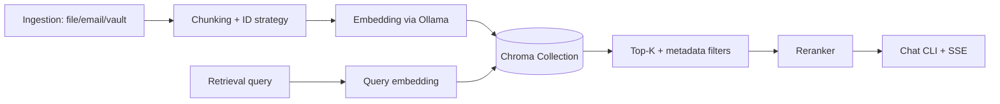

# Improvement: Add Persistent Vector Database (Feature 004)

## Current Behavior (Repo Scan)
Current RAG storage is file-based:
- Chunks are appended to `data/chunks.jsonl` by `app/ingestion/file_ingest_gui.py`, `app/ingestion/email_ingest_job.py`, and `app/migration/vault_migration.py`.
- Embeddings are appended to `data/embeddings.jsonl` by `app/indexing/embedding_indexer.py`.
- Retrieval (`app/retrieval/hybrid_search.py`) loads both files on each query, builds BM25 in-memory, computes dense similarity from loaded embeddings, then merges via RRF.
- Chat entrypoints call `retrieval.scored_chunks(...)` from `app/chat/document_chat_cli.py`, `app/chat/document_chat_baseline_cli.py`, `app/chat/email_chat_cli.py`, and `app/chat/streaming_server.py`.
- Config is managed by `config.yaml` + env overrides in `app/config/runtime_settings.py`.

Embedding provider is Ollama (`ollama.embeddings`) in `app/indexing/embedding_indexer.py` and `app/retrieval/hybrid_search.py`. Current configured model is `mxbai-embed-large`; target embedding dimension is 1024 and must be validated at runtime.

## Why This Is Insufficient
- Durability and lifecycle: app logic depends on ad-hoc JSONL files; no transactional upsert/delete by `doc_id`.
- Query performance: every query re-reads files and rebuilds BM25 structures.
- Operations: no first-class backup/restore process, no readiness check, no structured observability for storage operations.
- Scaling: difficult to support larger corpora, frequent incremental updates, and future multi-tenant filtering.

## Decision Matrix
| Candidate | Fit for this repo | Pros | Cons |
|---|---|---|---|
| Chroma (chosen) | Best fit (Python-only, local-first) | Persistent local DB, simple API, metadata filters, low ops overhead | Less operational tooling than DB-server options |
| Qdrant | Good for service-based deployment | Strong filtering, scalable, robust ops | Requires running separate service/container |
| PostgreSQL + pgvector | Good if Postgres already exists | Mature ops/backup/security ecosystem | Repo has no Postgres footprint today; larger migration scope |

Chosen DB: **Chroma persistent client** (`persist_directory`), as single source of truth.

## Target Architecture

## Data Model and IDs
Use one collection (default: `rag_chunks`) with deterministic IDs:
- `doc_id`: stable source document id.
- `chunk_id`: stable per chunk within a document.
- `vector_id`: `sha256(doc_id + ":" + chunk_id)` (primary key for upsert/idempotency).

Store:
- `id`: `vector_id`
- `embedding`: float vector (dim must match expected)
- `document`: `chunk_text` (store text in DB for retrieval simplicity)
- `metadata`: `doc_id`, `chunk_id`, `source`, `token_count`, `created_at`, `updated_at`, `embedding_model`, `embedding_dim`, optional `tags`, optional `tenant_id`

Filter support (future-proof): exact-match metadata filters via Chroma `where`.

## Migration and Cutover (No Backward Compatibility)
1. Add Chroma storage layer and retrieval adapter.
2. Implement one-time backfill command:
   - Reads `data/chunks.jsonl` (+ `data/embeddings.jsonl` when available).
   - Generates missing embeddings and upserts in batches.
   - Resume-safe by deterministic `vector_id` upsert.
3. Validate migration:
   - Count parity: chunk counts old vs new.
   - Retrieval sanity: run `eval/run_eval.py` before and after cutover.
4. Cut over ingestion/retrieval to Chroma.
5. Remove old storage paths/code (`chunks.jsonl`/`embeddings.jsonl` loading and writing paths).

## Config Changes
Add:
- `vector_db_provider: chroma`
- `vector_db_persist_dir: data/vector_db/chroma`
- `vector_db_collection: rag_chunks`
- `vector_db_batch_size: 64`
- `vector_db_timeout_s: 30`
- `embedding_dim: 1024`

Keep secrets in env only; do not hardcode credentials.

## Definition of Done
- All ingestion/upsert/delete/retrieval paths use Chroma only.
- Startup does not require full re-embed/full rebuild.
- `delete by doc_id` and incremental upsert are implemented.
- Backfill command is idempotent and validated.
- Tests cover ID generation, metadata mapping/filtering, and ingest->retrieve->delete flow.
- Old JSONL storage mechanisms are removed after cutover.

## Risks and Mitigations
- Dimension mismatch: hard-fail startup if provider embedding dim != configured `embedding_dim`.
- Duplicate chunks: deterministic IDs + upsert semantics.
- Partial failures during upsert: batch retries with bounded backoff + per-batch error logging.
- Migration cost/time: reuse existing embeddings when available; chunked backfill with progress checkpoints.
- Relevance drift from retrieval changes: run before/after eval and tune `top_k` + reranker weights.
- Windows file locking in local DB path: use per-run test persist dirs and explicit client close in tests.
